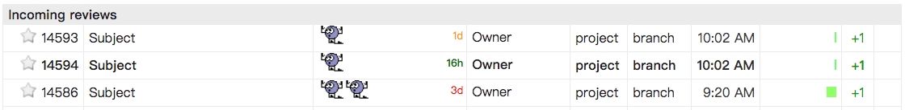
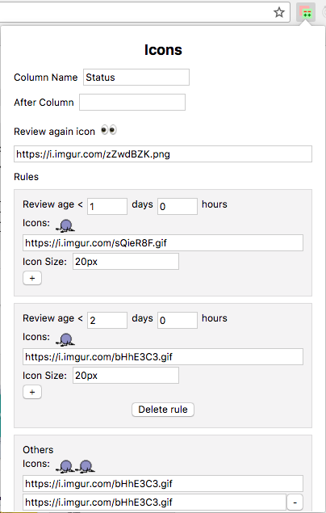

## Introduction
This is a Chrome extension for helping  [gerrit](https://gerrit.googlesource.com/gerrit) code review users to identify the incoming code reviews that he/she hasn't reviewed yet quickly.

## Features
1. Show customizable icons based on the review age (*Now - Commit initial submit time*)

   e.g (default):

   * Show  when review age 0~1 day
   * Show  when review age 1~2 days
   * Show  when review age > 2 days
   * Show  if need review again
   * Show nothing if already reviewed

2. Show review age with customizable color

   e.g (default):

   * Show 14h (green) when review age 0~1 day
   * Show 1d (orange) when age 1~2 day
   * Show 3d (red) when review age > 2 days

## Screenshots
1. Gerrit review listing page

2. Chrome extension popup settings

## Build
1. `npm install`
2. `npm run build`
3. `npm run prepare`
4. Package `GerritHelpReview/` to `.crx` in `chrome://extensions/`

## License

[MIT](http://opensource.org/licenses/MIT)

Copyright (c) 2018-present
